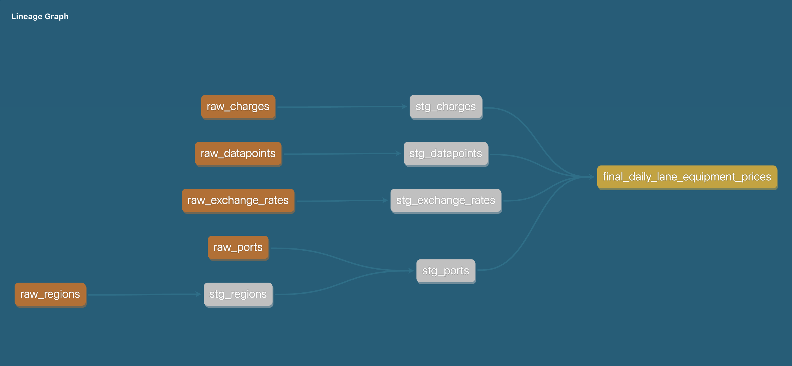

# Project - Data Engineer Case Study

## Overview
This repository is a solution for the Xeneta data engineering case study. It implements a local development pipeline using DuckDB + dbt (with optional DLT for ingestion exploration) and provides Evidence dashboard pages for data exploration and delivery.

## Primary Goals
- Produce a final table in the final schema containing average and median daily USD prices, aggregated by:
  - valid_day
  - equipment_id
  - origin (port/region)
  - destination (port/region)
- Provide data quality flag dq_ok (TRUE when >=5 distinct companies AND >=2 distinct suppliers).
- Support incremental loads (datapoints/charges arriving in batches) while ensuring correct recomputation for overlapping validity windows.
- Provide Evidence dashboards for stakeholders to explore daily prices, data quality coverage, and metadata snapshots.

## Tools Used
- Python 3.x (virtual environment recommended)
- DuckDB (Python package inside the venv)
- dbt (recommended v1.10 for this repo; pin versions in requirements)
- dbt-duckdb adapter
- dlt (optional) — used to explore ingestion patterns into DuckDB
- Evidence (optional) — for dashboard pages (evidence/pages/ contains .md pages)
- git for version control

## Repository Structure
- dlt/
  - (optional) scripts and small dlt project used to explore loading CSV files into DuckDB.
  - Included to demonstrate exploration of DLT-based ingestion; not required for the core dbt pipeline.
  - scripts/
    - load_data.py   : (Python) reads CSV files and writes into dev.duckdb raw schema; supports passing load_date as an argument
    - (other helpers) small utilities to inspect or load CSVs into DuckDB
  - But ultimately the core pipeline works without DLT, just explored DLT as an option and included in the repo.

- dbt_project/
  - dbt project (raw -> staging -> final)
  - models/
    - raw/         : models that read CSVs directly (read_csv_auto) into the raw schema for demo/manual runs
    - staging/     : deduplication and validation models (stg_datapoints, stg_charges, stg_exchange_rates, etc.)
    - final/       : final_daily_lane_equipment_prices.sql (the aggregation mart)
  - macros/        : utility macros, including snapshot_coverage macro that writes metadata coverage snapshots
  - reports/       : evidence/ reporting assets referenced by the dbt project
  - models.yml / schema.yml : model metadata, tests and descriptions

- input_files/
  - full_load/     : initial batch CSVs (DE_casestudy_ports.csv, DE_casestudy_datapoints_1.csv, charges_1, etc.)
  - incremental/   : subsequent batch CSVs (datapoints_2/3, charges_2/3)

- README.txt      : this file

## Important Design Decisions (short)
- Raw layer: keep CSVs ingested as-is (few metadata columns are added for audit purpose is added to track ingestion time).
- Staging layer: dedupe and clean the data wherever necessary. 
- Final layer: incremental materialization in dbt with unique_key = (valid_day, equipment_id, origin_port_id, destination_port_id) so dbt MERGE updates overlapping days.
- Incremental strategy: use created (ingestion timestamp) as the watermark to pick up new datapoints / charges. Recompute only the affected validity window: compute min(valid_from), max(valid_to) among newly created datapoints, expand only days overlapping this window (plus the new contracts).
- snapshot_coverage macro: creates/updates final.metadata_coverage to capture counts of distinct (origin,destination,equipment,valid_day) combinations with dq_ok = TRUE for pre/post snapshots.

## How to Run (examples)

### 1) Setup virtual environment and install python packages
``` 
python -m venv .venv
source .venv/bin/activate
pip install --upgrade pip
pip install -r requirements.txt
```

Requirements should include: duckdb, dbt-core (pin to 1.10.* if you use dbt 1.10), dbt-duckdb, dlt (optional), dbt-colibri, dbt-test-coverage (optional; check compatibility).

### 2) Optional: run DLT-based ingestion (not recommended, included for exploration)
``` 
python dlt_project/load_data_to_duckdb.py
```
- DLT approach will write to DB configured via dlt.config or .dlt/config.toml.
- This is included for exploration; core pipeline works without DLT.

``` 
python scripts/load_data.py '2025-09-20'
```
- The script will add a load_date column (DATE) to each raw table. If you omit the date it uses current date.
- DB file path is dbt_project/dev.duckdb by default in the script. Adjust as needed.

### 4) dbt: debug / deps / run
``` 
cd dbt_project
dbt debug
dbt deps            # install macro packages if any
dbt compile         # compile models to check for errors
dbt run -s tag:raw      # run with tag:raw --vars '{"load_date":"2025-09-05"}' to simulate historical load
dbt run -s tag:staging  # run with tag:staging --vars '{"load_date":"2025-09-05"}' to simulate historical load
dbt run -s tag:final    # run final models
dbt test             # run tests on final models
dbt docs generate    # generate docs site if needed
dbt docs serve       # serve docs site if needed
colibri generate     # optional: to check column-level lineage, install as pip install dbt-colibri
```



Examples for single-model runs:
``` 
dbt run --select final_daily_lane_equipment_prices
dbt test --select final_daily_lane_equipment_prices
```

### 5) Evidence pages (local)
- Start Evidence valid_fromia VSCode extention (project-specific; a generic command):
``` 
npm install
cd dbt_project
npm --prefix ./reports run dev
```
- The pages expect dbt refs compiled by Evidence to the dbt project / target; configure evidence.config.json to point to your dbt project and dev target.


## Parameters / Variables you would need to pass
- load_date: override ingestion date used in certain demo flows
  - In SQL models:
    - If load_date is none -> use current_date
    - Else -> cast('{{ load_date }}' as date)
- load_type: infered based on model run mode (full or incremental)

## Metadata Snapshots
- snapshot_coverage macro (macros/snapshot_coverage.sql) writes aggregated coverage into final.metadata_coverage, storing:
  - snapshot_ts, stage (before/after), covered_lane_count ( where dq_ok = true)
- Configure pre_hook and post_hook on the final model to run snapshot_coverage('before') and snapshot_coverage('after'). This lets you compute difference and track coverage growth per incremental batch.

## Evidence Pages Overview
- evidence/pages contains ready-to-use .md pages:
  - daily_shipping_prices.md (main dashboard)
  - data_quality.md (coverage explorer)
  - metadata_snapshots.md (before/after snapshot visualization)
  - regional_price_trends.md, port_to_port_median.md, coverage_explorer.md, variance_analysis.md
- These use coalesce(${inputs...}) so leaving filters blank will default to "all values".

## Tests and QA
- dbt tests:
  - not_null on keys such as valid_day
  - accepted_values on dq_ok (allowed values true/false) (use new syntax: arguments: values: [true,false])
  - uniqueness tests on primary keys in staging (e.g. unique d_id in stg_datapoints)
  - relationships tests on foreign keys (e.g. equipment_id in final referencing stg_equipment_type)
  - Contracts are included to enforce schema and data type expectations.

 ## Reproducibility / Environment Notes
- Preferred versions (example):
  - python: 3.10+ (adjust to your environment)
  - dbt-core: 1.8.2
  - dbt-duckdb: 1.8.4
  - duckdb python package: 1.3.x or 1.4.0
  - dlt: 1.6.0 (latest compatible version if you use it)
  - dbeaver: optional GUI for inspecting DuckDB files
  - evidence: latest version from npm, use VSCode extension for development and execution
- Use a virtual environment to avoid package conflicts.

## Folder by folder explanation (extended)
- dlt/: exploratory experiments to show I evaluated a streaming/incremental ingestion tool. Not necessary for final deliverable, but demonstrates I explored modern ingestion patterns. scripts/: convenience scripts for local loading and debugging (e.g., load_data.py). I included load_date argument support to simulate historical replays or fixed-load runs.
- dbt_project/: main transformation code implementing the raw -> staging -> final layers. This is the primary deliverable.
- dbt_project/reports/: contains Evidence dashboard assets for quick visualization of results; placing these next to dbt makes it easy for reviewers to inspect both data and dashboards.
- input_files/: contains the CSV bundles used for the assignment. I split full_load and incremental to simulate batch arrivals and wrote the raw models aligning with this assumption. Useful for simulating/testing incremental runs if I need to replay.
- user_queries/: optional saved SQL queries to provide to users.

## Example Workflow (end-to-end, concise)
### 1) Activate venv and install deps.
``` 
python -m venv .venv
source .venv/bin/activate
pip install -r requirements.txt
```
### 2) Load initial raw files:
``` 
cd dbt_project
dbt deps
dbt run -s tag:raw --vars '{"load_date":"2025-09-05"}'
```
### 3) Run dbt (build staging + final):
``` 
dbt run -tag:staging --vars '{"load_date":"2025-09-05"}'
dbt test -s models/staging/
dbt run -tag:final
dbt test -s models/final/
```
### 4) Inspect results in Evidence by copying evidence/pages/*.md into your Evidence project and running Evidence.

## Notes / Caveats
- dbt and dbt-test-coverage / other community packages may have compatibility issues across major dbt versions. If you use dbt-test-coverage, pin dbt-core to the compatible version (commonly 1.8.*).
- DuckDB internal assertion errors are typically caused by version mismatches (adapter vs python duckdb). Use venv python and pinned packages to avoid this.
- DLT resources naming and usage can be tricky; I included a small dlt example but kept the dbt pipeline as the main ingest path. DLT load even introduces it's own metadata columns and tables, which may complicate the schema.

## Next Steps / Improvements
- If you'd like, I can:
  - Add more Evidence pages or polish visuals and filters, right now they are very basic.
  - Add more dbt tests or data validation checks and unit-tests.
  - Convert the DLT experiments into a CI-run pipeline.

## Time Spent and Work Log
- Explored the provided data files for data cleanliness/quality, duplicates, unique keys and mapped schemas (raw tables: ports, regions, exchange_rates, datapoints, charges), understood relationships and documented the models in excel.
- Spent time understanding assignment requirements and edge cases (overlapping valid_from/valid_to ranges, incremental loads, exchange rate handling).
- Set up local dev environment using Python virtualenv, installed duckdb, dbt, dbeaver and other miscalaneous packages.
- Explored multiple ingestion options (direct read_csv_auto into DuckDB, and an experimental DLT-based pipeline for incremental ingestion).
- Implemented dbt models for raw -> staging -> final, including deduplication logic in staging and incremental/merge logic in final.
- Built Evidence pages for stakeholders: dashboards for daily prices, data quality coverage, and metadata snapshots.
- Iterated on tests and schema docs (dbt schema.yml) to include descriptions and data tests for key columns.
